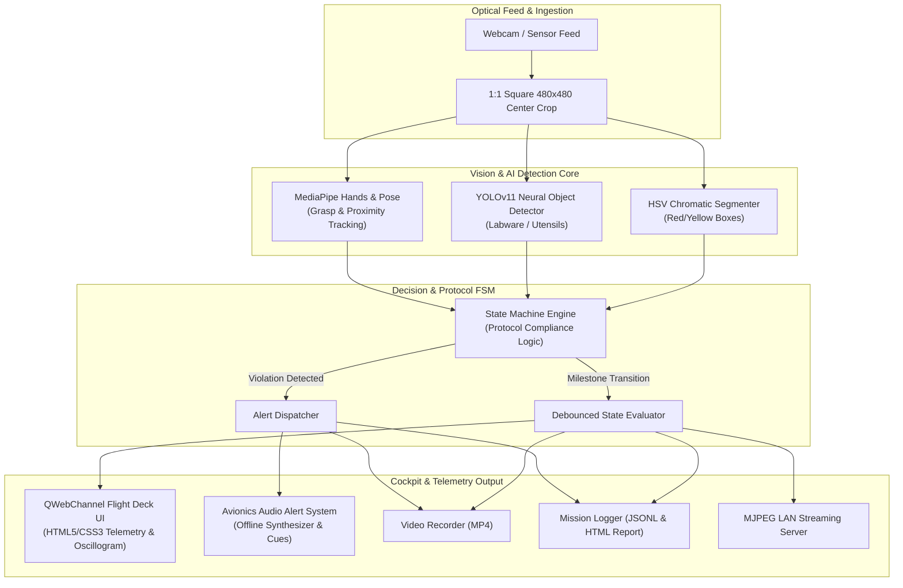

<div align="center">

# 🛰️ VYOM • ISRO BAS MISSION CONTROL
### AI Human Activity Recognition & Protocol Compliance Assistant for On-Board BAS Experiments
**Smart India Hackathon • Problem Statement ID: SIH26174**

---

[](https://python.org)
[](https://doc.qt.io/qtforpython/)
[](https://github.com/ultralytics)
[](https://mediapipe.dev)
[](https://opencv.org)
[](https://github.com/vaibhavneematech/ISRO-BAS-EXPERIMENTS-)

<br />

<p align="center">
  <b>An aerospace-grade, edge-deployable computer vision flight deck designed to assist astronauts in executing complex Biological and Physical Sciences (BAS) research protocols inside microgravity habitats.</b>
</p>

[Key Features](#-key-features) •
[System Architecture](#-system-architecture) •
[Supported Protocols](#-supported-protocols) •
[Tech Stack](#-technology-stack) •
[Installation](#-installation--quick-start) •
[Verification & Testing](#-verification--testing)

---

</div>

## 🌌 Executive Summary

During on-board spaceflight missions (such as Gaganyaan / orbital space stations), astronauts conduct critical **Biological & Physical Sciences (BAS)** experiments under stringent time constraints and high operational stress. A single skipped step, contaminated sample, or out-of-order action can compromise months of scientific payload research.

**VYOM** is an intelligent, air-gapped on-board assistant that runs locally on edge compute. Using multi-threaded computer vision, temporal finite state machines (FSM), and multimodal telemetry, VYOM observes operator workflow in real-time, validates protocol adherence, triggers instant auditory warnings on procedural violations, and generates auditable mission debrief logs.

---

## ⚡ Key Features

| Capability | Engineering Highlights |
| :--- | :--- |
| **🎯 Hybrid Detection Pipeline** | Dual-engine visual processing: calibrated **HSV color segmentation** for high-speed chromatic target tracking combined with **YOLOv11 neural inference** for tools, labware, and objects. |
| **🖐️ Biometric & Spatial Interaction** | **MediaPipe Hands & Pose/Face** integration calculates 3D bounding geometry, finger contact heuristics, and dynamic operator-to-object proximity. |
| **⚙️ Deterministic Protocol FSM** | Temporal state machine with milestone debouncing, preventing race conditions or false triggers while tracking step sequences, skipped actions, and out-of-order execution. |
| **🔊 Avionics Auditory Guidance** | 100% offline multi-cue auditory feedback: dual-tone positive confirmation chime (`880 Hz → 1318.5 Hz`) on success, with specialized voice alerts for skipped steps, wrong sequences, and experiment completion. |
| **🖥️ Chromium Flight Deck UI** | Modern PySide6 desktop interface embedding an aerospace Chromium HUD via `QWebChannel`, featuring a live telemetry strip, 1:1 square viewfinder, and proximity oscillogram canvas. |
| **📡 LAN Telemetry & Streaming** | Built-in lightweight **MJPEG streamer** allows ground station or remote crew members on the local network to inspect live mission telemetry and video feeds. |
| **📋 Blackbox Mission Audit** | High-precision **JSONL telemetry event logs** accompanied by one-click automated **HTML interactive mission reports** detailing timing, compliance %, and violation logs. |

---

## 📐 System Architecture



---

## 🔬 Supported Protocols

VYOM ships with standardized, extensible JSON protocol definitions located in [`config/protocols/`](config/protocols/):

1. **`isro_bas_boxes.json` (P1 - Flagship ISRO BAS Experiment)**
   - *Milestones*: Baseline detection of dual Red & Yellow experiment cassettes → selective extraction of Red box with hand grasp → extraction of Yellow box → selective return of Red box → complete sample return and experiment seal.
2. **`bottle_handling.json` (P2 - Fluid Handling & Bottle Transfer)**
   - Tracks liquid container uncapping, fluid extraction, and secure containment.
3. **`cup_placement.json` (P3 - Smart Labware Positioning)**
   - Precision placement of diagnostic cups in designated orbital test rack zones.
4. **`notebook_transfer.json` (P4 - Data Log Procedure)**
   - Physical transfer and logging protocol compliance for manual flight journals.
5. **`phone_pickup.json` (P5 - Handheld Telemetry Tool Inspection)**
   - Pick-and-place tracking for auxiliary telemetry and diagnostic handhelds.

---

## 🛠️ Technology Stack

- **Core & Runtime**: Python 3.10 / 3.11
- **GUI & Display Engine**: PySide6 (Qt 6), QtWebEngine, QWebChannel, HTML5/CSS3/Vanilla JS Canvas
- **Deep Learning & Computer Vision**:
  - `ultralytics` (YOLOv11n)
  - `mediapipe` (Hand, Face & Pose Landmark Tasks)
  - `opencv-python` (Spatial transformation, HSV filtering, contour analysis)
- **Machine Learning**: `scikit-learn`, `numpy`
- **Audio & Synthesis**: Windows SAPI / `System.Speech` synthesizer & standard `wave` audio engine
- **Streaming & I/O**: `http.server` (MJPEG LAN), Thread-safe Queues, JSONL

---

## 📁 Repository Structure

```text
SIH26174-BAS-HAR/
├── assets/
│   ├── audio/               # Avionics auditory confirmation wavs and voice cues
│   └── icons/               # Mission insignia and flight deck icons
├── config/
│   ├── experiment_protocol.json  # Active protocol pointer
│   └── protocols/           # Standardized JSON protocol rulesets (P1 - P5)
├── models/
│   ├── yolo11n.pt           # Lightweight neural object detector
│   ├── hand_landmarker.task # MediaPipe hand geometry task
│   ├── pose_landmarker_lite.task # MediaPipe operator pose task
│   ├── face_landmarker.task # MediaPipe facial landmark task
│   └── activity_classifier.pkl # Trained HAR classifier & scaler
├── scripts/
│   ├── run_gui.py           # Primary mission control cockpit launcher
│   ├── setup_audio.py       # Audio synthesizer & audio asset builder
│   ├── verify_sounds.py     # Sound engine verification & debounce tests
│   ├── test_live_protocol.py# Live camera test harness for protocol states
│   └── train_model.py       # Model training pipeline
├── src/
│   ├── alerts/              # Thread-safe audio player & avionics alert manager
│   ├── detection/           # HSV segmentation, YOLOv11, and MediaPipe detectors
│   ├── features/            # Spatial feature extraction & distance metrics
│   ├── gui/                 # Flight deck MainWindow, HUD widgets & WebBridge
│   ├── logging/             # JSONL telemetry blackbox logger & HTML report generator
│   ├── ml/                  # Activity classification inference module
│   ├── protocol/            # Protocol state machine & transition rules
│   ├── recording/           # Local MP4 session video recorder
│   └── streaming/           # Multi-client LAN MJPEG video streamer
├── tests/                   # Automated unit and integration tests
├── .gitignore               # Excludes bytecode, temp logs, and recordings
├── run.bat                  # One-click Windows launch script
└── README.md                # Project documentation
```

---

## 🚀 Installation & Quick Start

### 1. Clone the Repository
```bash
git clone https://github.com/vaibhavneematech/ISRO-BAS-EXPERIMENTS-.git
cd ISRO-BAS-EXPERIMENTS-
```

### 2. Set Up Python Environment
Recommended: Python 3.10 or 3.11 on Windows / Linux:
```powershell
python -m venv venv
.\venv\Scripts\activate
```

### 3. Install Dependencies
```bash
pip install -r requirements.txt
```
*(Or install core dependencies manually: `pip install PySide6 opencv-python mediapipe ultralytics numpy scikit-learn`)*

### 4. Launch Mission Control
You can either double-click **`run.bat`** or run:
```powershell
python scripts\run_gui.py
```

---

## 🧪 Verification & Testing

Verify system components independently using dedicated test harnesses:

```powershell
# Verify audio synthesizer and debounce logic
python scripts\verify_sounds.py

# Test camera, HSV box segmentation, and MediaPipe hand tracking
python scripts\test_hsv_and_hands.py

# Run state machine unit tests
python -m unittest discover tests/
```

---

## 📊 Mission Debrief & Audit Reports

When a mission is concluded or stopped:
1. All telemetry events are stored chronologically in `logs/vyom_mission_<TIMESTAMP>.jsonl`.
2. An interactive, standalone mission debrief report is compiled in `reports/report_vyom_mission_<TIMESTAMP>.html`.
3. The report displays:
   - **Protocol Compliance Score (%)**
   - **Total Duration & Elapsed Timelines**
   - **Milestone Completion Flow**
   - **Protocol Violation Log (Skipped Steps / Sequence Errors)**

---

## 👥 Acknowledgments & Hackathon Details

- **Initiative**: Smart India Hackathon (SIH)
- **Problem Statement ID**: **SIH26174**
- **Domain**: Space Technology / ISRO Biological Application Support (BAS)
- **Author**: [Vaibhav Neema](https://github.com/vaibhavneematech)

<div align="center">
  <sub>Developed for next-generation manned space exploration. Built with precision for ISRO BAS Missions.</sub>
</div>
